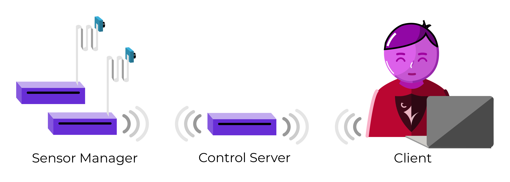
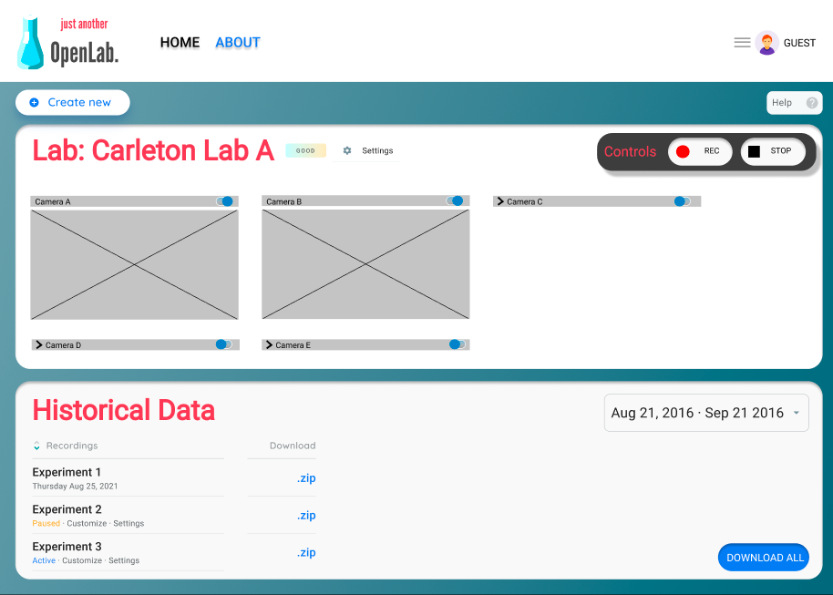

# Just Another OpenLab

An open-source data collection tool designed to meet the evolving challenges of data-driven analysis in life-science research.

This project was submitted to [cuHacking2021](https://2021.cuhacking.com/), where it received the prize for best hardware hack. We are currently in the proof-of-concept stage and are actively raising awareness in order to gauge community interest and seek feedback/partnerships. 

If you have any questions, please contact andretelfer@cmail.carleton.ca.

## Introduction

As the use of machine-learning and data-driven analysis has risen in the life-sciences, so has the need for improved data collection and sharing. 

1. **Expanded Capabilities**: simultaneous data collection from multiple sources.

   Traditionally, analysis of experimental data has often performed manually using data collected from few devices. However increasingly advanced machine-learning models allow and often require data from more sources. In animal-models, a growing number of open-source projects like [DeepLabCut](http://www.mousemotorlab.org/deeplabcut), [SiMBA](https://github.com/DeepLabCut/DeepLabCut), and [DeepSqueak](https://github.com/DrCoffey/DeepSqueak) are capable of consuming multiple types of data from multiple sources. This revolution in data-analysis is driving new types of research and is becoming increasingly deployed and relied on by groups around the world. However many labs struggle to adapt to new data collection requirements such as simultaneous collection from multiple cameras as well as other sources such as audio and EM signals. 

   This project creates a synchronized data collection framework that can connect to any device capable of providing a data-stream. It provides web-access in order to allow remote live-data viewing and control.

2. **Reproducibility**: improved internal experiment documentation and packaging that encourages open-data practices.

   Recent meta-research articles on scientific reproducibility have repeatedly singled out life-science domains as being acutely impacted. This project provides a streamlined interface to create structed experimental data and metadata in order to:

   - Improve reproducibility by preventing the loss of important information caused by researchers leaving the team, time-drift of experimental practice, and separation/loss of experiment variables. 
   - Passively encourage data sharing by storing data in popular open-data formats. 

3. **Long Term Usage**: maintainability and scaling.

   Many research labs have explored custom data-collection solutions and are now facing a maintainability issues. The most frequent causes of this are that:

   - Coding ability of life-science faculty and graduate students is highly variable. After the creator of a data-collection system leaves the group (ex. graduates or moves on to other research), labs struggle to modify previous code and are forced to reinvest time into a new system. 
   - Code is often written to solve a specific research problem and cannot be easily adapted to evolving requirements or other teams. 

   This project provides an open-source framework and long-term development, customization, and community support.

## System 

An uncluttered system that lets authenticated users view and record data from anywhere. 

- **Sensor**: devices for collecting data.
- **Sensor Managers**: computers that connect to sensors and provide API endpoints for controlling them, storing data, and streaming data. We suggest single-board computers such as the Raspberry Pi in order to reduce space and cost (Most Raspberry Pis are the size of a credit card and can be purchased for as little as $10). Sensor Managers code can be easily customized to connect to new types of sensors.
- **Backend Server**: this server provides a centralized backend in order to control each sensor-manager. It serves up a web page that can be accessed from anywhere by authenticated users. 

## Development State

This repository is currently in a proof-of-concept state as we raise awareness in order to access interest and seek feedback for future development. 

### Proof of Concept Work
A prototype was developed at cuhacking2021 that demonstrated several of the core features. 
- RTMP Video Streaming from Sensor Managers using FFmpeg and NGINX 
- Local Data Storage
- Flask API End Points to Start, Stop, and Download Data from Sensor Managers
- React Frontend

### Future Work

Are you a researcher? We want to connect with you. 

We are actively seeking to connect with labs to gather feedback and designs to maximize the usefulness of this project. 

The next stage of this project will be directed to gauging community interest, gathering feedback, redesigning the UI workflows and backend systems to fully realize the goals set out in the introduction.

## Authors

Andre Telfer (andretelfer@cmail.carleton.ca).    
Harshdeep (harshdeepkairon@yahoo.com)     
Muhammad Bilal Zubair (solidhydrogenblock@gmail.com)    
Mithra Perera        

