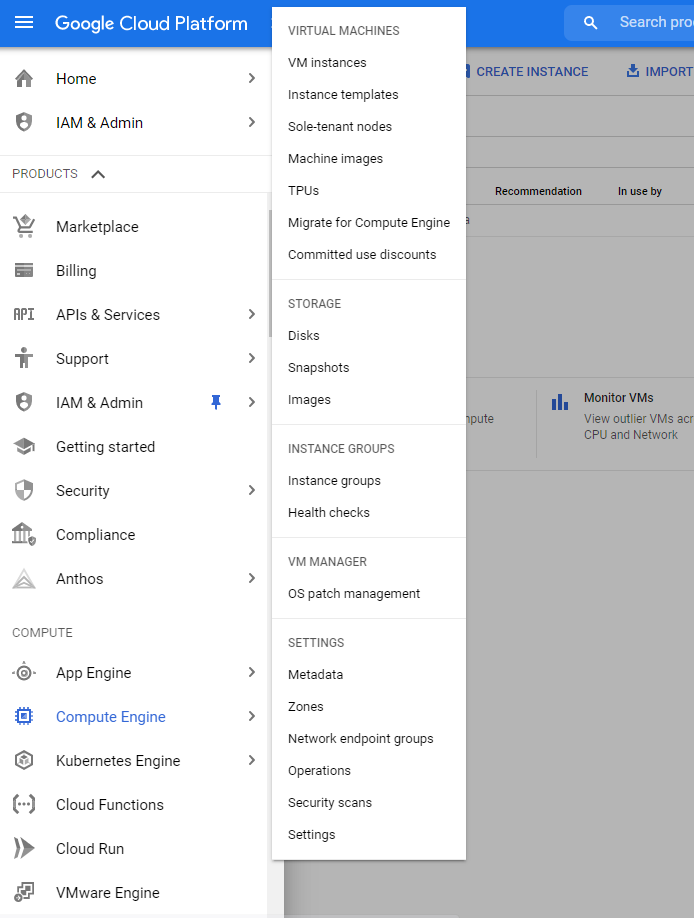
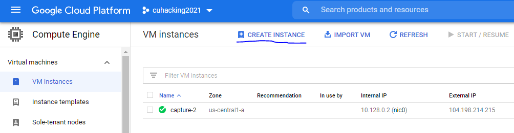
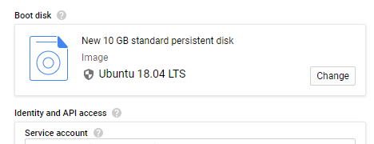
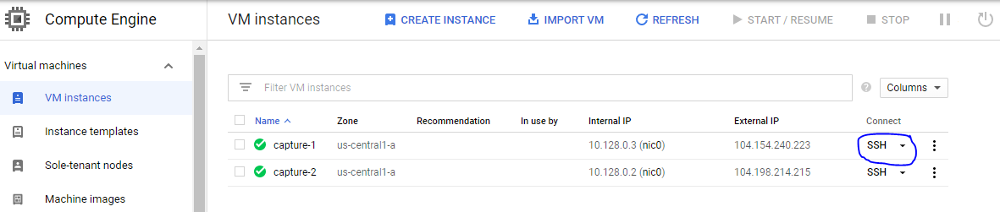

# Virtual Camera on GCloud

## Creating an Instance

1. Log into G-Cloud console: https://console.cloud.google.com/

    If this is your first time, you may need to set up things like billing in later steps

2. Navigate to Compute Engine > Virtual Instances:    
     

3. Create Instance
     

4. Change the instance OS to Ubuntu 18.04, then create the instance
     

5. You should now be able to connect to the instance using the SSH button 
     

## v4l2loopback

### Setup

Docs: https://github.com/umlaeute/v4l2loopback

The following should setup 

```
sudo apt update
sudo apt install -y build-essential linux-modules-extra-gcp linux-generic ffmpeg v4l-utils

git clone https://github.com/umlaeute/v4l2loopback
cd v4l2loopback
make && sudo make install
sudo depmod -a
sudo modprobe v4l2loopback devices=4
```

Now running `v4l2-ctl --list-device` should list 4 video devices (ex. /dev/video0)

### Run

To run a video as if it's coming from the loopback use:

```
ffmpeg -stream_loop -re -i testsrc.avi -f v4l2 /dev/video1
```

Replace /dev/video1 with whichever video device you want to use, and testsrc.avi with your video file

