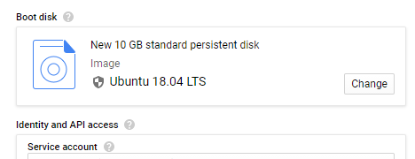

# Virtual Camera on GCloud

## Creating an Instance

1. Log into G-Cloud console: https://console.cloud.google.com/

    If this is your first time, you may need to set up things like billing in later steps

2. Navigate to Compute Engine > Virtual Instances:    
     

3. Create Instance
     

4. Change the instance OS to Ubuntu 18.04, then create the instance
     

5. You should now be able to connect to the instance using the SSH button 
     

## Setup 

Docs: https://github.com/umlaeute/v4l2loopback

```
sudo apt update
sudo apt install -y build-essential linux-modules-extra-gcp linux-generic ffmpeg v4l-utils python3-pip
sudo -H pip3 install --upgrade youtube-dl

git clone https://github.com/umlaeute/v4l2loopback
cd v4l2loopback
make && sudo make install
sudo depmod -a
sudo modprobe v4l2loopback devices=4
```

Now running `v4l2-ctl --list-device` should list 4 video devices (ex. /dev/video0)

## Run

### Creating a Virtual Camera Device

Download a video from youtube:
```
youtube-dl https://www.youtube.com/watch?v=-1dSY6ZuXEY --output "spooky.%(ext)s"
```

To run a video as if it's coming from a camera (/dev/video0)

```
ffmpeg -stream_loop -1 -re -i spooky.mp4 -f v4l2 /dev/video0
```

